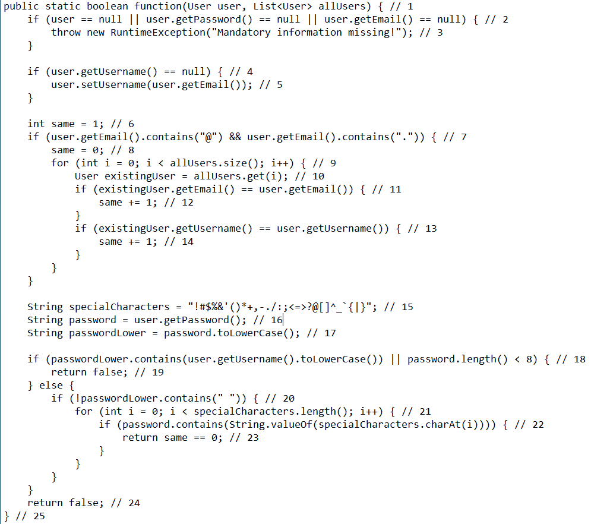

# Втора лабораториска вежба по Софтверско инженерство

## Тамара Ончевска, бр. на индекс 213020

###  Control Flow Graph

### Цикломатска комплексност

Цикломатската комплексност на овој код е 11, истата ја добив со броење региони на графот, вкупно има 10 затворени и еден надворешен кој го опфаќа целиот граф, тоа се вкупно 10+1=11.

### Тест случаи според критериумот  Every Branch

....

### Тест случаи според критериумот Multiple Condition

.... 
### Редни броеви на кодот

