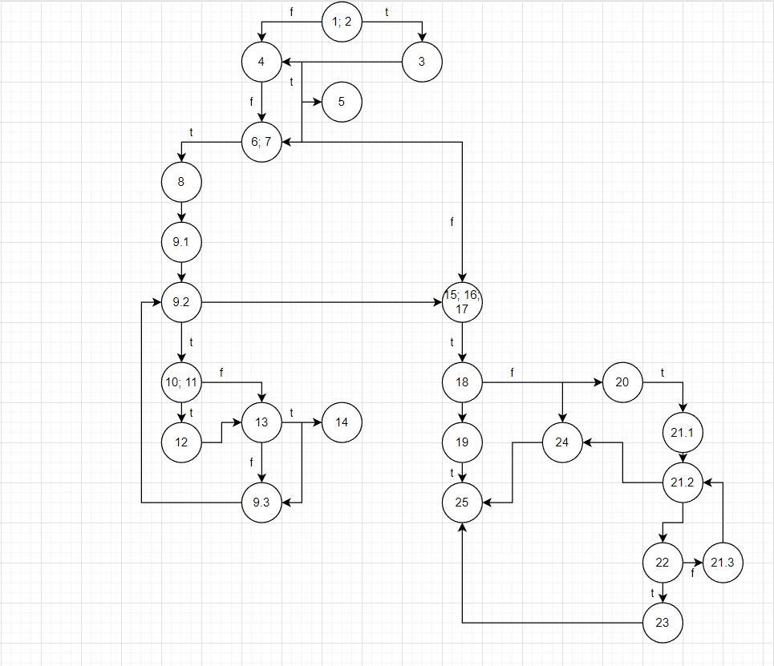

# Втора лабораториска вежба по Софтверско инженерство

## Тамара Ончевска, бр. на индекс 213020

###  Control Flow Graph

### Цикломатска комплексност

Цикломатската комплексност на овој код е 11, истата ја добив со броење региони на графот, вкупно има 10 затворени и еден надворешен кој го опфаќа целиот граф, тоа се вкупно 10+1=11.

### Тест случаи според критериумот  Every Branch

За да се помине секоја гранка од графот потребни се 5 тест случаеви.

### Тест случаи според критериумот Multiple Condition

Имаме различни тест случаи и тоа:
1. Кога првиот услов е false, вториот е true и третиот нема влијание врз резултатот. (f,t,?)
2. Кога првиот услов е false, вториот е false и третиот мора да биде true. (f,f,t)
3. Кога првиот е true, другите два немаат влијание и функцијата враќа true. (t,?,?)
4. Кога сите услови се false, функцијата враќа false. (f,f,f)

### Редни броеви на кодот

